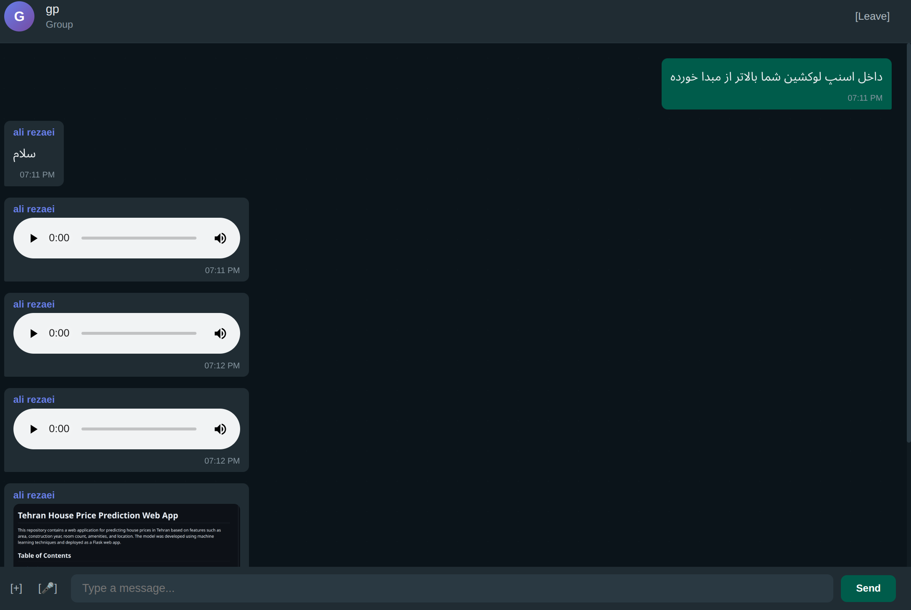
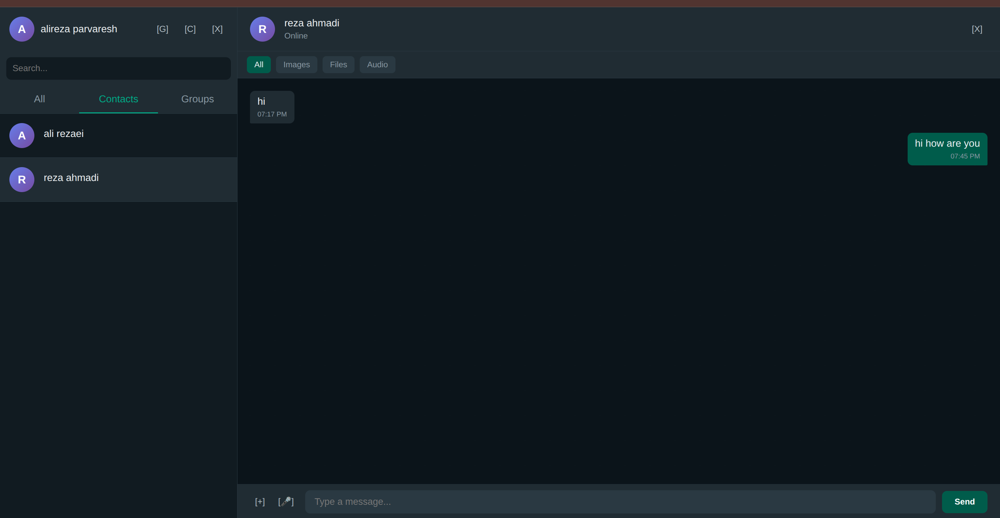

# TCP Chat Application

> **WARNING - CRITICAL INFRASTRUCTURE**  
> This repository is designed to facilitate communication for Iranian citizens during protests and internet shutdowns. It operates on domestic servers to maintain connectivity when external internet access is restricted or censored. Use responsibly and ensure secure deployment in sensitive environments.

A feature-rich chat application with a WhatsApp-like UI, built with Go and Server-Sent Events for real-time communication.

## Screenshots




*Modern WhatsApp-like interface with real-time messaging, groups, and media sharing*

---

## Features

### Authentication and Security
* **User Registration and Login** - Complete authentication system
* **Password Hashing** - Using SHA256
* **Secure Sessions** - User management with SSE
* **User Blocking** - Block/unblock unwanted users
* **Mutual Contact System** - Two-way contact addition

### Messaging
* **Private Chat** - One-on-one messaging with privacy controls
* **Group Chats** - Create and manage groups with members
* **Leave Group** - Exit from groups you no longer want to be in
* **File Sharing** - Send images, videos, and files
* **Voice Messages** - Record and send voice messages
* **Media Filtering** - Filter messages by type (images/files/audio)
* **Typing Indicator** - Shows when user is typing
* **Real-time Messaging** - Using Server-Sent Events
* **Message Blocking** - Blocked users cannot send you messages

### User Management
* **Username Search** - Find and add users by username
* **Contact Management** - Add/remove contacts easily
* **Block List** - View and manage blocked users
* **Group Member Management** - Add members from your contacts

### User Interface
* **WhatsApp-like Design** - Modern and familiar UI
* **Dark Mode** - Eye-comfortable dark theme
* **Responsive** - Works on desktop and mobile
* **Media Preview** - Display images and videos in chat
* **Audio Player** - Built-in player for voice messages
* **Media Filter Tabs** - Quick access to specific media types
* **Smooth Animations** - Professional user experience
* **Loading States** - Clear feedback during operations

### Technical
* **SQLite Database** - Data storage
* **Server-Sent Events** - Real-time communications
* **RESTful API** - Modern architecture
* **Docker** - Ready for deployment
* **Offline Capability** - Works on local networks without internet

---

## Project Structure

```
chatApp/
├── cmd/
│   └── server/
│       └── main.go        # Main server with SSE and API
├── public/
│   ├── index.html         # Web UI
│   └── app.js             # Frontend logic
├── uploads/               # Uploaded files
├── chat.db                # SQLite database
├── Dockerfile             # Docker image
├── docker-compose.yml     # Service configuration
├── go.mod                 # Go dependencies
└── README.md              # This file
```

---

## Quick Start

### Prerequisites

* Go 1.21 or later
* Docker and Docker Compose (optional)
* Modern web browser

---

## Running Locally

### 1. Install Dependencies

```bash
go mod download
```

### 2. Run Server

```bash
go run cmd/server/main.go
```

Server runs on `http://localhost:8080`

### 3. Open in Browser

Go to `http://localhost:8080` and:
1. Register or login
2. Search for other users
3. Start chatting!

---

## Running with Docker

### Build and Run

```bash
docker-compose up --build
```

### Access the Application

Go to `http://localhost:8080`

### Stop Services

```bash
docker-compose down
```

---

## Usage Guide

### Registration and Login

1. Open the login page
2. Click "Register"
3. Enter username, full name, and password
4. After registration, login

### Starting a Private Chat

1. Click the chat button `[C]` (New Chat)
2. **Option A - Search by Username:**
   - Type a username in the search box
   - Click "Search"
   - Click "Add Contact" if found
3. **Option B - Select from List:**
   - Browse all users below
   - Click "Add" to add as contact
   - Click on contact to start chatting

### Blocking/Unblocking Users

1. Open a private chat
2. Click the block button `[X]` in chat header
3. To unblock, click the `[✓]` button

### Filtering Messages by Media Type

In private chats:
1. Use the filter tabs: **All | Images | Files | Audio**
2. View only specific types of shared media

### Sending Voice Messages

1. Press and hold the microphone button `[🎤]`
2. Record your voice message
3. Release to send automatically

### Creating a Group

1. Click the group button `[G]` (New Group)
2. Enter group name
3. Select members from **your contacts**
4. Click "Create Group"

### Leaving a Group

1. Open a group chat
2. Click the `[Leave]` button in chat header
3. Confirm to leave the group

### Sending Media

1. Click the attachment button in the input area
2. Select an image or video
3. File is automatically uploaded and sent

### Additional Features

* **Search**: Use the search box to find contacts
* **Typing**: When you type, the other party sees it
* **Online Status**: See online status indicator

---

## API Endpoints

### Authentication

* `POST /api/register` - Register new user
* `POST /api/login` - User login

### Users and Contacts

* `GET /api/users` - Get user list
* `GET /api/contacts?userId={id}` - Get user's contacts
* `POST /api/contacts` - Add contact (mutual)
* `DELETE /api/contacts` - Remove contact

### Blocking

* `POST /api/block` - Block a user
* `POST /api/unblock` - Unblock a user
* `GET /api/blocked?userId={id}` - Get blocked users list
* `GET /api/isblocked?blockerId={id}&blockedId={id}` - Check if blocked

### Groups

* `GET /api/groups?userId={id}` - Get user's groups
* `POST /api/groups` - Create new group
* `POST /api/groups/leave` - Leave a group

### Messages

* `GET /api/messages?userId={id}&contactId={id}` - Get private messages
* `GET /api/messages?userId={id}&contactId={id}&mediaFilter={type}` - Get filtered messages
* `GET /api/messages?userId={id}&groupId={id}` - Get group messages
* `POST /api/send` - Send message
* `POST /api/typing` - Send typing indicator
* `GET /events?userId={id}` - SSE connection

### Media

* `POST /api/upload` - Upload file (images/videos/audio/voice)
* `GET /uploads/{filename}` - Get uploaded file

---

## Database Schema

### users table
```sql
- id (INTEGER PRIMARY KEY)
- username (TEXT UNIQUE)
- full_name (TEXT)
- password (TEXT - SHA256 hash)
- created_at (DATETIME)
```

### contacts table
```sql
- user_id (INTEGER)
- contact_id (INTEGER)
- added_at (DATETIME)
- PRIMARY KEY(user_id, contact_id)
```

### blocked_users table
```sql
- blocker_id (INTEGER)
- blocked_id (INTEGER)
- blocked_at (DATETIME)
- PRIMARY KEY(blocker_id, blocked_id)
```

### groups table
```sql
- id (INTEGER PRIMARY KEY)
- name (TEXT)
- creator_id (INTEGER)
- created_at (DATETIME)
```

### group_members table
```sql
- group_id (INTEGER)
- user_id (INTEGER)
- joined_at (DATETIME)
```

### messages table
```sql
- id (INTEGER PRIMARY KEY)
- from_user (INTEGER)
- to_user (INTEGER, nullable)
- group_id (INTEGER, nullable)
- content (TEXT, nullable)
- media_url (TEXT, nullable)
- media_type (TEXT, nullable - image/video/file/audio/voice)
- timestamp (DATETIME)
```

---

## Production Deployment

### Environment Variables

```bash
PORT=8080              # Server port
```

### Security Notes

1. Use HTTPS in production
2. Enforce strong passwords
3. Implement rate limiting
4. Regular database backups
5. Input validation and sanitization

---

## Development
x] ~~Voice messages~~ ✅ Completed
- [x] ~~User blocking~~ ✅ Completed
- [x] ~~Username search~~ ✅ Completed
- [x] ~~Media filtering~~ ✅ Completed
- [x] ~~Leave group~~ ✅ Completed
- [ ] JWT authentication
- [ ] End-to-end encryption
- [ ] Voice/video calls
- [ ] Push notifications
- [ ] Emoji reactions
- [ ] Location sharing
- [ ] Message read receipt

### Dependencies

* `github.com/mattn/go-sqlite3` - SQLite driver

---

## TODO / Future Improvements

- [ ] JWT authentication
- [ ] End-to-end encryption
- [ ] Voice/video calls
- [ ] Push notifications
- [ ] Emoji reactions
- [ ] Location sharing
- [ ] Voice messages
- [ ] Custom themes
- [ ] Mobile app (React Native)

---

## Contributing

Contributions are welcome! Please:

1. Fork the repository
2. Create a feature branch
3. Commit your changes
4. Push to the branch
5. Create a Pull Request

---

## License

This project is released under the MIT License.

---

## Ethical Use

This tool is designed to help free communication during critical times. Please:

* Use responsibly and legally
* Respect user privacy
* Avoid misuse
* Be aware of security requirements

---

## Support

For issues, questions, or feature requests:
* Create an Issue on GitHub
* Join discussions

---

**Built for free communication**


